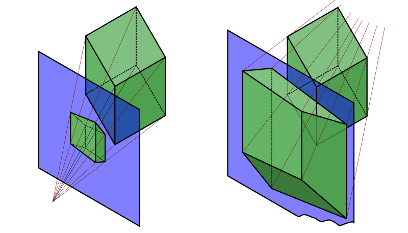
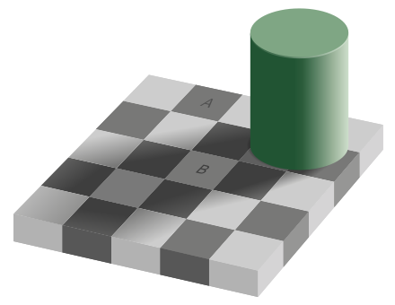
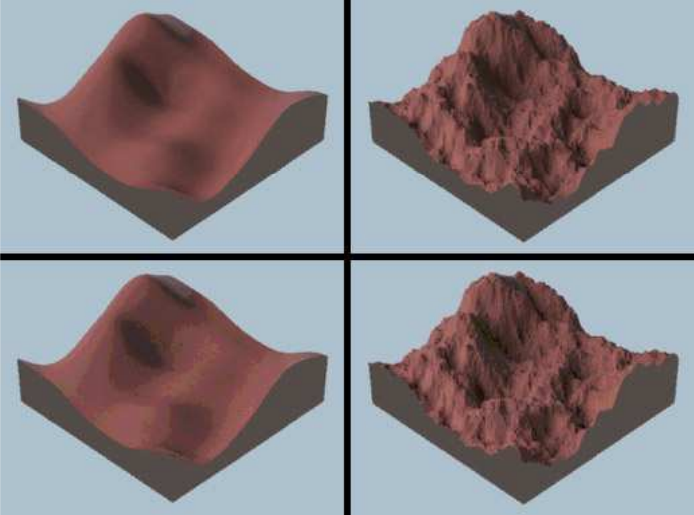

<section id="themes">
    <h2>Themes</h2>
        <p>
            Set your presentation theme: <br>
            <!-- Hacks to swap themes after the page has loaded. Not flexible and only intended for the reveal.js demo deck. -->
                        <a href="#" onclick="document.getElementById('theme').setAttribute('href','css/theme/black.css'); return false;">Black (default)</a> -
            <a href="#" onclick="document.getElementById('theme').setAttribute('href','css/theme/white.css'); return false;">White</a> -
            <a href="#" onclick="document.getElementById('theme').setAttribute('href','css/theme/league.css'); return false;">League</a> -
            <a href="#" onclick="document.getElementById('theme').setAttribute('href','css/theme/sky.css'); return false;">Sky</a> -
            <a href="#" onclick="document.getElementById('theme').setAttribute('href','css/theme/beige.css'); return false;">Beige</a> -
            <a href="#" onclick="document.getElementById('theme').setAttribute('href','css/theme/simple.css'); return false;">Simple</a> <br>
            <a href="#" onclick="document.getElementById('theme').setAttribute('href','css/theme/serif.css'); return false;">Serif</a> -
            <a href="#" onclick="document.getElementById('theme').setAttribute('href','css/theme/blood.css'); return false;">Blood</a> -
            <a href="#" onclick="document.getElementById('theme').setAttribute('href','css/theme/night.css'); return false;">Night</a> -
            <a href="#" onclick="document.getElementById('theme').setAttribute('href','css/theme/moon.css'); return false;">Moon</a> -
            <a href="#" onclick="document.getElementById('theme').setAttribute('href','css/theme/solarized.css'); return false;">Solarized</a>
        </p>
</section>

H:

# Visual Computing Cognitive Aspects

Jean Pierre Charalambos

H:

# Index

 1. History of Linear Perspective <!-- .element: class="fragment" data-fragment-index="1"-->
 2. Depth Perception <!-- .element: class="fragment" data-fragment-index="2"-->
 3. Optical Illusions <!-- .element: class="fragment" data-fragment-index="3"-->
 4. Final thoughts <!-- .element: class="fragment" data-fragment-index="4"-->

H:

## History of Linear Perspective

### Before linear perspective

<figure>
    
    <figcaption><a href="http://en.wikipedia.org/wiki/Chauvet_Cave">Chauvet painting</a></figcaption>
</figure>

V:

## History of Linear Perspective

### Before linear perspective

<figure>
    
    <figcaption><a href="http://en.wikipedia.org/wiki/Chauvet_Cave">Chauvet painting</a></figcaption>
</figure>

V:

## History of Linear Perspective

### Before linear perspective

<figure>
    
    <figcaption><a href="http://es.wikipedia.org/wiki/Cueva_de_Altamira">Altamira painting</a></figcaption>
</figure>

V:

## History of Linear Perspective

### Before linear perspective

<figure>
    
    <figcaption><a href="http://es.wikipedia.org/wiki/Cueva_de_Altamira">Altamira painting</a></figcaption>
</figure>

V:

## History of Linear Perspective

### Before linear perspective

<figure>
    
    <figcaption><a href="http://es.wikipedia.org/wiki/Cueva_de_Altamira">Altamira painting</a></figcaption>
</figure>

V:

## History of Linear Perspective

### Before linear perspective

<figure>
    
    <figcaption>Medieval Fresco</figcaption>
</figure>

V:

## History of Linear Perspective

### Before linear perspective

<figure>
    
    <figcaption>Medieval Fresco</figcaption>
</figure>

V:

## History of Linear Perspective

### Before linear perspective

<figure>
    
    <figcaption>[Oblique perspective](https://en.wikipedia.org/wiki/Oblique_projection). Song dinasty, 12th century</figcaption>
</figure>

V:

## History of Linear Perspective

### Before linear perspective

<figure>
    
    <figcaption>[Reverse perspective](https://en.wikipedia.org/wiki/Reverse_perspective). Byzantine perspective</figcaption>
</figure>

V:

## History of Linear Perspective

### Before linear perspective

<figure>
    
    <figcaption>[Reverse perspective](https://en.wikipedia.org/wiki/Reverse_perspective). Byzantine perspective</figcaption>
</figure>

V:

## History of Linear Perspective

### Linear Perspective: Brunelleschi's Experiment

<section>
    <iframe width="720" height="480" src="http://www.youtube.com/embed/bkNMM8uiMww"></iframe>
</section>

V:

## History of Linear Perspective

### Linear Perspective: Brunelleschi's Experiment

<section>
    <iframe width="720" height="480" src="http://www.youtube.com/embed/eOksHhQ8TLM"></iframe>
</section>

V:

## History of Linear Perspective

### Alberti's Veil

<figure>
    
    <figcaption><a href="http://en.wikipedia.org/wiki/Albrecht_D%C3%BCrer">Dürer's Alberti Veil</a></figcaption>
</figure>

V:

## History of Linear Perspective

### Alberti's Veil

<figure>
    
    <figcaption><a href="http://en.wikipedia.org/wiki/Albrecht_D%C3%BCrer">Dürer's Alberti Veil</a></figcaption>
</figure>

V:

## History of Linear Perspective

### Uccello perspective study of a vase

<figure>
    
    <figcaption><a href="http://en.wikipedia.org/wiki/Perspective_(graphical)#Renaissance_:_Mathematical_basis">Perspective study of a vase by Paolo Uccello (Galleria degli Uffizi, Gabinetto dei Disegni)</a></figcaption>
</figure>


H:

## Depth Perception

### Monocular cues

<figure>
    
    <figcaption>[Parallax](https://en.wikipedia.org/wiki/Parallax)</figcaption>
</figure>

V:

## Depth Perception

### Monocular cues

<figure>
    
    <figcaption>Motion parallax</figcaption>
</figure>

V:

## Depth Perception

### Monocular cues

<figure>
    
    <figcaption>Depth from motion</figcaption>
</figure>

V:

## Depth Perception

### Monocular cues

<figure>
    
    <figcaption>[Kinetic depth effect](https://en.wikipedia.org/wiki/Kinetic_depth_effect)</figcaption>
</figure>

V:

## Depth Perception

### Monocular cues

<section>
    <iframe width="720" height="480" src="https://www.youtube.com/embed/TQB4T6mTXAY"></iframe>
</section>

V:

## Depth Perception

### Monocular cues

<section>
    <iframe width="720" height="480" src="https://www.youtube.com/embed/gq70rca1P1I"></iframe>
</section>

V:

## Depth Perception

### Monocular cues

<figure>
    
    <figcaption>Perspective</figcaption>
</figure>

V:

## Depth Perception

### Monocular cues

<figure>
    
    <figcaption>[Curvilinear perspective](https://en.wikipedia.org/wiki/Curvilinear_perspective)</figcaption>
</figure>

V:

## Depth Perception

### Monocular cues

<figure>
    
    <figcaption>[Curvilinear perspective](https://en.wikipedia.org/wiki/Curvilinear_perspective)</figcaption>
</figure>

V:

## Depth Perception

### Monocular cues

<figure>
    
    <figcaption>[Aerial perspective](https://en.wikipedia.org/wiki/Aerial_perspective)</figcaption>
</figure>

V:

## Depth Perception

### Monocular cues

<figure>
    
    <figcaption> Relative size and familiar size</figcaption>
</figure>

V:

## Depth Perception

### Monocular cues

<figure>
    
    <figcaption> <a href="https://github.com/remixlab/proscene/tree/3.0/examples/Model/DOF">Depth-of-Field (DOF)</a></figcaption>
</figure>

V:

## Depth Perception

### Monocular cues

<figure>
    
    <figcaption> <a href="https://github.com/remixlab/proscene/tree/3.0/examples/Model/DOF">Depth-of-Field (DOF)</a></figcaption>
</figure>

V:

## Depth Perception

### Binocular cues

<figure>
    
    <figcaption>[Stereopsis](https://en.wikipedia.org/wiki/Stereopsis)</figcaption>
</figure>

H:

## Optical Illusions
### [Visual perception](https://en.wikipedia.org/wiki/Visual_perception)

1. (Classical) [Emission theory](https://en.wikipedia.org/wiki/Visual_perception#Early_studies) vs [Intromission theory](https://en.wikipedia.org/wiki/Visual_perception#Early_studies)
2. [Unconscious inference](https://en.wikipedia.org/wiki/Unconscious_inference) (Hermann von Helmholtz):
 * light comes from above
 * objects are normally not view from below
 * faces are seen (and recognized) upright
 * closer objects can block the view of more distant objects

> Visual (cognitive) illusions (inference process failure) -> visual system assumptions insight
<!-- .element: class="fragment" data-fragment-index="1"-->

V:

## Optical Illusions (Physiological)

### Mach's band

<div id='MachBands_id'></div>

V:

## Optical Illusions (Physiological)

### [Checker shadow](https://en.wikipedia.org/wiki/Checker_shadow_illusion)



V:

## Optical Illusions (Physiological)

### [Checker shadow](https://en.wikipedia.org/wiki/Checker_shadow_illusion)


V:

## Optical Illusions (Physiological)

### Color gradient

<div id='color_gradient_id'></div>

V:

## Optical Illusions (Physiological)

### [White's Illusion](https://en.wikipedia.org/wiki/White's_illusion)

<div id='whites_id'></div>

V:

## Optical Illusions (Physiological)

### [Watercolor Illusion](https://en.wikipedia.org/wiki/Watercolor_illusion)

<div id='watercolor_id'></div>

V:

## Optical Illusions (Physiological)

### Grid illusions

<figure>
    
    <figcaption> Hermann grid </figcaption>
</figure>

V:

## Optical Illusions (Physiological)

### Grid illusions

<div id='scintillating_id'></div>
Scintillating grid

V:

## Optical Illusions (Physiological)

### Grid illusions

Note that the scintillating [grid code](https://github.com/VisualComputing/Cognitive/blob/gh-pages/sketches/scintillating_grid.js) is:

```js
function setup() {
    var myCanvas = createCanvas(400, 400);
    myCanvas.parent('scintillating_id');
    strokeWeight(3);        // medium weight lines
    smooth();               // antialias lines
    stroke(100, 100, 100);  // dark grey colour for lines
    noLoop();

}

function draw() {
    background(0);          // black background
    var step = 25;          // grid spacing

    //vertical lines
    for (var x = step; x < width; x = x + step) {
        line(x, 0, x, height);
    }

    //horizontal lines
    for (var y = step; y < height; y = y + step) {
        line(0, y, width, y);
    }

    // Circles
    ellipseMode(CENTER);
    stroke(255, 255, 255);  // white circles
    for (var i = step; i < width -5; i = i + step) {
        for (var j = step; j < height -15; j = j + step) {
            strokeWeight(6);
            point(i, j);
            strokeWeight(3);
        }
    }
}
```

V:

## Optical Illusions (Physiological)

### Grid illusions

Hacking instructions (setup and run) found [here](https://github.com/VisualComputing/Cognitive/tree/gh-pages)

V:

## Optical Illusions (Cognitive)

### Ambiguous illusions

<figure>
    
    <figcaption>Necker's cube</figcaption>
</figure>

V:

## Optical Illusions (Cognitive)

### Ambiguous illusions

<figure>
    
    <figcaption>Rubin's jar</figcaption>
</figure>

V:

## Optical Illusions (Cognitive)

### Ambiguous illusions

<figure>
    
    <figcaption>[Swans Reflecting Elephants](http://en.wikipedia.org/wiki/Swans_Reflecting_Elephants) by [Salvador Dalí](http://en.wikipedia.org/wiki/Salvador_Dal%C3%AD), 1937</figcaption>
</figure>

V:

## Optical Illusions (Cognitive)

### Geometrical-optical (or distorting) illusions

<div id='cafe_wall_id'></div>
Cafe-Wall

V:

## Optical Illusions (Cognitive)

### Geometrical-optical (or distorting) illusions

<figure>
    
    <figcaption>Cafe-Wall</figcaption>
</figure>

V:

## Optical Illusions (Cognitive)

### Geometrical-optical (or distorting) illusions

<div id='Zollner_id'></div>
Zollner ilussion

V:

## Optical Illusions (Cognitive)

### Geometrical-optical (or distorting) illusions
<div id='MullerLyer_id'></div>
Muller-Lyer

V:

## Optical Illusions (Cognitive)

### Geometrical-optical (or distorting) illusions

<div id='poggendorff_id'></div>
[Poggendorff Illusion](https://en.wikipedia.org/wiki/Poggendorff_illusion)

V:

## Optical Illusions (Cognitive)

### Geometrical-optical (or distorting) illusions

<figure>
    <div id='ponzo_id'></div>
    <figcaption>Ponzo illusion</figcaption>
</figure>

V:

## Optical Illusions (Cognitive)

### Paradox illusions

<figure>
    <div id='PenroseTriangle_id'></div>
    <figcaption>[Penrose Triangle](https://en.wikipedia.org/wiki/Penrose_triangles)</figcaption>
</figure>

V:

## Optical Illusions (Cognitive)

###  Paradox illusions

<figure>
    
    <figcaption><a href="http://en.wikipedia.org/wiki/Waterfall_(M._C._Escher)">Escher's Waterfall</a></figcaption>
</figure>


V:

## Optical Illusions (Cognitive)

###  Paradox illusions

<figure>
    
    <figcaption>Penrose Staircase</figcaption>
</figure>

V:

## Optical Illusions (Cognitive)

###  Paradox illusions

<figure>
    
    <figcaption><a href="http://en.wikipedia.org/wiki/Ascending_and_Descending">Escher's Ascending and Descending</a></figcaption>
</figure>

V:

## Optical Illusions (Cognitive)

### Fictions

<figure>
    
    <figcaption>Kanizsa triangle</figcaption>
</figure>

V:

## Optical Illusions (Movement)

<div id='MotionBinding_id'></div>
Motion Binding

V:

## Optical Illusions (Movement)

<div id='Anstis_id'></div>
Stuart Anstis ilussion

V:

## Optical Illusions (Movement)

<div id='IllusorySquare_id'></div>
[Illusory Square](https://www.geek.com/news/10-astonishing-optical-illusion-gifs-1575117/)

V:

## Optical Illusions (others)

<div id='Ebbinghaus_id'></div>
Ebbinghaus illusion

V:

## Optical Illusions (others)

<div id='lilacChaser_id'></div>
Lilac Chaser Illusion

N:
Combination of:
1. Phi phenomenon: is the optical illusion of perceiving continuous motion between separate objects viewed rapidly in succession
2. Afterimages
3. Troxler's fading: When a blurry stimulus is presented to a region of the visual field away from where we are fixating, and we keep our eyes still, that stimulus will disappear even though it is still physically presented

V:

## Optical Illusions (others)

<figure>
    
    <figcaption>Movement illusions</figcaption>
</figure>

V:

## Optical Illusions (others)

<figure>
    
    <figcaption>Movement illusions</figcaption>
</figure>

V:

## Optical Illusions (others)

<figure>
    <div id='checker_id'></div>
    <figcaption>Checker</figcaption>
</figure>

V:

## Optical Illusions (others)

<figure>
    <div id='stroboscopicMotion_id'></div>
    <figcaption>Stroboscopic Motion</figcaption>
</figure>

V:

## Optical Illusions (others)

<figure>
    <div id='rotateSquare_id'></div>
    <figcaption>Rotate Square Motion</figcaption>
</figure>

V:

## Optical Illusions (others)

<figure>
    
    <figcaption>Spinning dancer</figcaption>
</figure>

N:

These results can be explained by a psychological study providing evidence for a viewing-from-above bias that influences observers' perceptions of the silhouette. The results indicated that there was no clockwise bias, but rather viewing-from-above bias

V:

## Optical Illusions (others)

<figure>
    
    <figcaption>Positron imagery</figcaption>
</figure>

V:

## Optical Illusions (others)

<div id='pinna_id'></div>
Pinna ilussion

V:

## Optical Illusions (others)

<div id='silencing_id'></div>
Silencing Illusion

V:

## Optical Illusions (others)

<div id='wagonWheel_id'></div>
Wagon Wheel Illusion

H:

## Final thoughts
### Optical illusions in research

<figure>
    
    <figcaption>8 & 4 bits quantised images, upper and lower pairs resp.</figcaption>
</figure>

N:

Visual masking describes the perceptual phenomenon that the presence of one visual
pattern can affect the visibility of another pattern [FSPG97, KB05].

V:

## Final thoughts
### Nature of reality
#### [Do we see reality as it is? | Donald Hoffman](https://www.youtube.com/watch?v=oYp5XuGYqqY)

Evolutionary game simulations between competing organisms some of which perceive (part-of) reality as it is and some which perceive only fitness  <!-- .element: class="fragment" data-fragment-index="1"-->

> Results: evolution doesn't favor veridical perceptions (they go extinct)

<!-- .element: class="fragment" data-fragment-index="2"-->

> Conclusion: we construct what we see

<!-- .element: class="fragment" data-fragment-index="3"-->

V:

## Final thoughts
### Nature of reality
#### [Simulation argument | Nick Bolstrom](https://www.simulation-argument.com/)

<li class="fragment"> The human species is very likely to go extinct before reaching a “posthuman” stage
<li class="fragment"> Any posthuman civilization is extremely unlikely to run a significant number of simulations of their evolutionary history (or variations thereof)
<li class="fragment"> we are almost certainly living in a computer simulation.

H:

## References

* [Cueva de Altamira](http://es.wikipedia.org/wiki/Cueva_de_Altamira)
* [Chauvet Cave](http://en.wikipedia.org/wiki/Chauvet_Cave)
* <a href="http://en.wikipedia.org/wiki/Perspective_(graphical)">Perspective</a>
* [Linear Perspective](http://new.math.uiuc.edu/public403/perspective/alberti/alberti.html)
* [Albrecht Dürer](http://en.wikipedia.org/wiki/Albrecht_D%C3%BCrer)
* [The origins of perspective](https://www.dartmouth.edu/~matc/math5.geometry/unit11/unit11.html)
* [Depth perception](http://en.wikipedia.org/wiki/Depth_perception)
* [Optical Illusion](http://en.wikipedia.org/wiki/Optical_illusion)
* [Simulation argument](https://www.simulation-argument.com/)
* [You are a Simulation & Physics Can Prove It: George Smoot](https://www.youtube.com/watch?v=Chfoo9NBEow&t=14s)
* [Do we see reality as it is? | Donald Hoffman](https://www.youtube.com/watch?v=oYp5XuGYqqY)
