<section id="themes">
	<h2>Themes</h2>
		<p>
			Set your presentation theme: <br>
			<!-- Hacks to swap themes after the page has loaded. Not flexible and only intended for the reveal.js demo deck. -->
			<a href="#" onclick="document.getElementById('theme').setAttribute('href','css/theme/black.css'); return false;">Black (default)</a> -
			<a href="#" onclick="document.getElementById('theme').setAttribute('href','css/theme/white.css'); return false;">White</a> -
			<a href="#" onclick="document.getElementById('theme').setAttribute('href','css/theme/league.css'); return false;">League</a> -
			<a href="#" onclick="document.getElementById('theme').setAttribute('href','css/theme/sky.css'); return false;">Sky</a> -
			<a href="#" onclick="document.getElementById('theme').setAttribute('href','css/theme/beige.css'); return false;">Beige</a> -
			<a href="#" onclick="document.getElementById('theme').setAttribute('href','css/theme/simple.css'); return false;">Simple</a> <br>
			<a href="#" onclick="document.getElementById('theme').setAttribute('href','css/theme/serif.css'); return false;">Serif</a> -
			<a href="#" onclick="document.getElementById('theme').setAttribute('href','css/theme/night.css'); return false;">Night</a> -
			<a href="#" onclick="document.getElementById('theme').setAttribute('href','css/theme/moon.css'); return false;">Moon</a> -
			<a href="#" onclick="document.getElementById('theme').setAttribute('href','css/theme/solarized.css'); return false;">Solarized</a>
		</p>
</section>

H:

# Visual Computing Cognitive Aspects

Jean Pierre Charalambos

H:

# Index

 1. History of Linear Perspective <!-- .element: class="fragment" data-fragment-index="1"-->
 2. Depth Perception <!-- .element: class="fragment" data-fragment-index="2"-->
 3. Optical Illusions <!-- .element: class="fragment" data-fragment-index="3"-->
 
H:

## History of Linear Perspective

### Before linear perspective

<figure>
    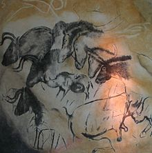
    <figcaption><a href="http://en.wikipedia.org/wiki/Chauvet_Cave">Chauvet painting</a></figcaption>
</figure>

V:

## History of Linear Perspective

### Before linear perspective

<figure>
    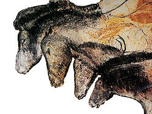
    <figcaption><a href="http://en.wikipedia.org/wiki/Chauvet_Cave">Chauvet painting</a></figcaption>
</figure>

V:

## History of Linear Perspective

### Before linear perspective

<figure>
    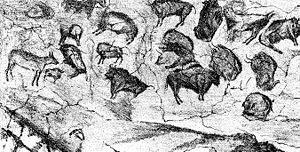
    <figcaption><a href="http://es.wikipedia.org/wiki/Cueva_de_Altamira">Altamira painting</a></figcaption>
</figure>

V:

## History of Linear Perspective

### Before linear perspective

<figure>
    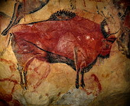
    <figcaption><a href="http://es.wikipedia.org/wiki/Cueva_de_Altamira">Altamira painting</a></figcaption>
</figure>

V:

## History of Linear Perspective

### Before linear perspective

<figure>
    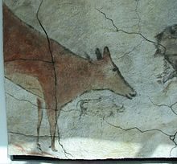
    <figcaption><a href="http://es.wikipedia.org/wiki/Cueva_de_Altamira">Altamira painting</a></figcaption>
</figure>

V:

## History of Linear Perspective

### Before linear perspective

<figure>
    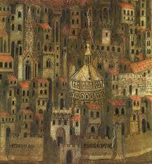
    <figcaption>Medieval Fresco</figcaption>
</figure>

V:

## History of Linear Perspective

### Before linear perspective

<figure>
    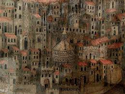
    <figcaption>Medieval Fresco</figcaption>
</figure>

V:

## History of Linear Perspective

### Before linear perspective

<figure>
    
    <figcaption>Medieval Fresco</figcaption>
</figure>

V:

## History of Linear Perspective

### Before linear perspective

<figure>
    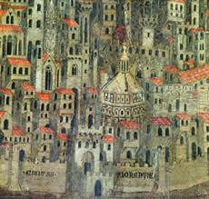
    <figcaption>Medieval Fresco</figcaption>
</figure>

V:

## History of Linear Perspective

### Before linear perspective

<figure>
    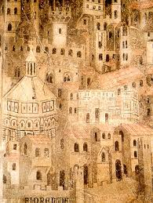
    <figcaption>Medieval Fresco</figcaption>
</figure>

V:

## History of Linear Perspective

### Before linear perspective

<figure>
    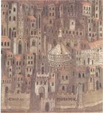
    <figcaption>Medieval Fresco</figcaption>
</figure>

V:

## History of Linear Perspective

### Linear Perspective: Brunelleschi's Experiment

<section>
	<iframe data-autoplay width="420" height="345" src="http://www.youtube.com/embed/bkNMM8uiMww"></iframe>
</section>

V:

## History of Linear Perspective

### Alberti's Veil

<figure>
    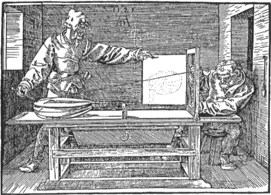
    <figcaption><a href="http://en.wikipedia.org/wiki/Albrecht_D%C3%BCrer">Dürer's Alberti Veil</a></figcaption>
</figure>

V:

## History of Linear Perspective

### Alberti's Veil

<figure>
    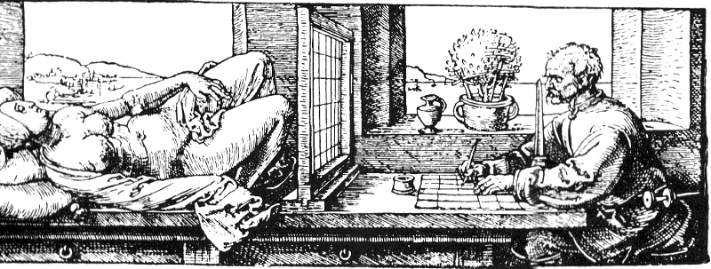
    <figcaption><a href="http://en.wikipedia.org/wiki/Albrecht_D%C3%BCrer">Dürer's Alberti Veil</a></figcaption>
</figure>

V:

## History of Linear Perspective

### Uccello perspective study of a vase

<figure>
    
    <figcaption><a href="http://en.wikipedia.org/wiki/Perspective_(graphical)#Renaissance_:_Mathematical_basis">Perspective study of a vase by Paolo Uccello (Galleria degli Uffizi, Gabinetto dei Disegni)</a></figcaption>
</figure>


H:

## Depth Perception

### Monocular cues

<figure>
    
    <figcaption>Parallax</figcaption>
</figure>

V:

## Depth Perception

### Monocular cues

<figure>
    
    <figcaption>Depth from motion</figcaption>
</figure>

V:

## Depth Perception

### Monocular cues

<figure>
    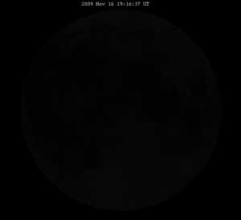
    <figcaption>Kinetic depth effect</figcaption>
</figure>

V:

## Depth Perception

### Monocular cues

<figure>
    
    <figcaption>Perspective</figcaption>
</figure>

V:

## Depth Perception

### Monocular cues

<figure>
    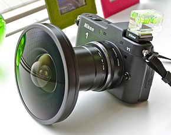
    <figcaption>Curvilinear perspective</figcaption>
</figure>

V:

## Depth Perception

### Monocular cues

<figure>
    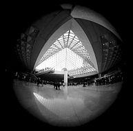
    <figcaption>Curvilinear perspective</figcaption>
</figure>

V:

## Depth Perception

### Monocular cues

<figure>
    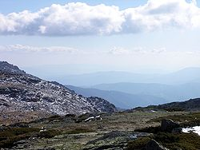
    <figcaption> Aerial perspective</figcaption>
</figure>

V:

## Depth Perception

### Monocular cues

<figure>
    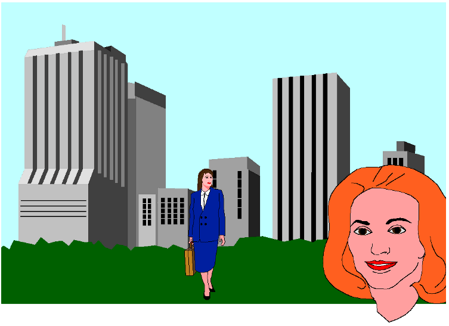
    <figcaption> Relative size and familiar size</figcaption>
</figure>

V:

## Depth Perception

### Monocular cues

<figure>
    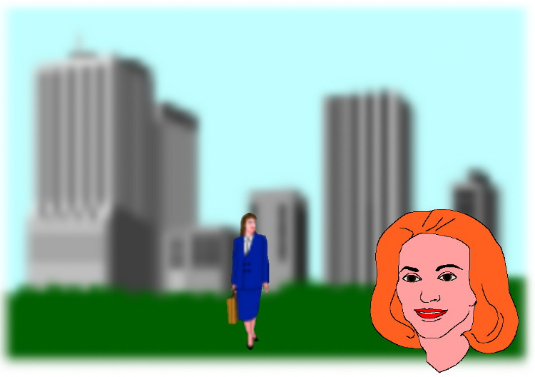
    <figcaption> <a href="https://github.com/remixlab/proscene/tree/3.0/examples/Model/DOF">Depth-of-Field (DOF)</a></figcaption>
</figure>

V:

## Depth Perception

### Monocular cues

<figure>
    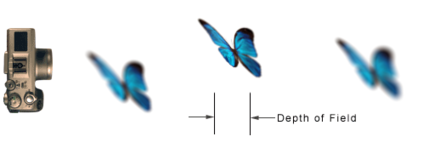
    <figcaption> <a href="https://github.com/remixlab/proscene/tree/3.0/examples/Model/DOF">Depth-of-Field (DOF)</a></figcaption>
</figure>

V:

## Depth Perception

### Binocular cues

<figure>
    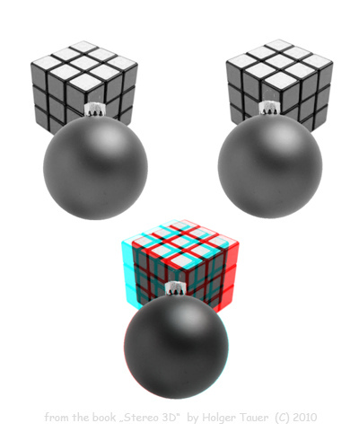
    <figcaption> Stereopsis</figcaption>
</figure>

H:

## Optical Illusions (Physiological)

### Mach's band


V:

## Optical Illusions (Physiological)

### Grid illusions

<figure>
    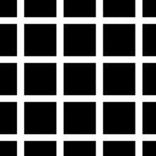
    <figcaption> Hermann grid </figcaption>
</figure>

V:

## Optical Illusions (Physiological)

### Grid illusions

<div id='scintillating_id'></div>
Scintillating grid

V:

## Optical Illusions (Physiological)

### Grid illusions

Note that the scintillating [grid code](https://github.com/VisualComputing/Cognitive/blob/gh-pages/sketches/scintillating_grid.js) is:

```js
function setup() {
    var myCanvas = createCanvas(400, 400);
    myCanvas.parent('scintillating_id');
    strokeWeight(3);        // medium weight lines 
    smooth();               // antialias lines
    stroke(100, 100, 100);  // dark grey colour for lines
    noLoop();
 
}

function draw() {
    background(0);          // black background
    var step = 25;          // grid spacing
    
    //vertical lines
    for (var x = step; x < width; x = x + step) {
        line(x, 0, x, height);
    }
    
    //horizontal lines
    for (var y = step; y < height; y = y + step) {
        line(0, y, width, y);
    }
    
    // Circles
    ellipseMode(CENTER);
    stroke(255, 255, 255);  // white circles
    for (var i = step; i < width -5; i = i + step) {
        for (var j = step; j < height -15; j = j + step) {
            strokeWeight(6); 
            point(i, j);
            strokeWeight(3); 
        }
    }
}
```

V:

## Optical Illusions (Physiological)

### Grid illusions

Hacking instructions (setup and run) found [here](https://github.com/VisualComputing/Cognitive/tree/gh-pages) 

V:

## Optical Illusions (Cognitive)

### Ambiguous illusions

<figure>
    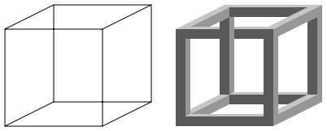
    <figcaption>Necker's cube</figcaption>
</figure>

V:

## Optical Illusions (Cognitive)

### Ambiguous illusions

<figure>
    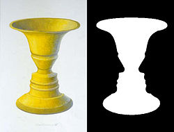
    <figcaption>Rubin's jar</figcaption>
</figure>

V:

## Optical Illusions (Cognitive)

### Ambiguous illusions

<figure>
    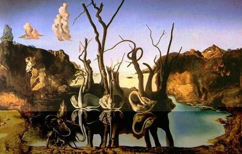
    <figcaption>[Swans Reflecting Elephants](http://en.wikipedia.org/wiki/Swans_Reflecting_Elephants) by [Salvador Dalí](http://en.wikipedia.org/wiki/Salvador_Dal%C3%AD), 1937</figcaption>
</figure>

V:

## Optical Illusions (Cognitive)

### Geometrical-optical illusions

<figure>
    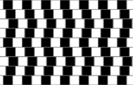
    <figcaption>Cafe-Wall</figcaption>
</figure>

V:

## Optical Illusions (Cognitive)

### Geometrical-optical illusions

<figure>
    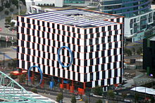
    <figcaption>Cafe-Wall</figcaption>
</figure>

V:

## Optical Illusions (Cognitive)

### Geometrical-optical illusions

<figure>
    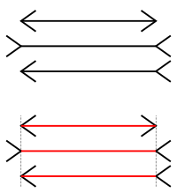
    <figcaption>Muller-Lyer</figcaption>
</figure>

V:

## Optical Illusions (Cognitive)

### Geometrical-optical illusions

<figure>
    
    <figcaption>Ponzo illusion</figcaption>
</figure>

V:

## Optical Illusions (Cognitive)

### Paradox illusions

<figure>
    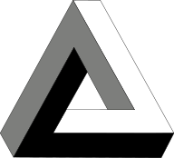
    <figcaption>Penrose Triangle</figcaption>
</figure>

V:

## Optical Illusions (Cognitive)

###  Paradox illusions

<figure>
    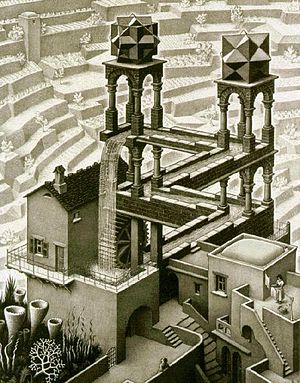
    <figcaption><a href="http://en.wikipedia.org/wiki/Waterfall_(M._C._Escher)">Escher's Waterfall</a></figcaption>
</figure>


V:

## Optical Illusions (Cognitive)

###  Paradox illusions

<figure>
    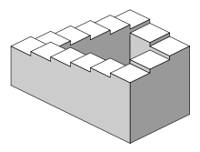
    <figcaption>Penrose Staircase</figcaption>
</figure>

V:

## Optical Illusions (Cognitive)

###  Paradox illusions

<figure>
    
    <figcaption><a href="http://en.wikipedia.org/wiki/Ascending_and_Descending">Escher's Ascending and Descending</a></figcaption>
</figure>

V:

## Optical Illusions (Cognitive)

### Fictions

<figure>
    
    <figcaption>Kanizsa triangle</figcaption>
</figure>

V:

## Optical Illusions (others)

<figure>
    
    <figcaption>Ebbinghaus illusion</figcaption>
</figure>

V:

## Optical Illusions (others)

<figure>
    
    <figcaption><a href="http://en.wikipedia.org/wiki/Lilac_chaser">Lilac Chaser or "Pacman"</a></figcaption>
</figure>

V:

## Optical Illusions (others)

<figure>
    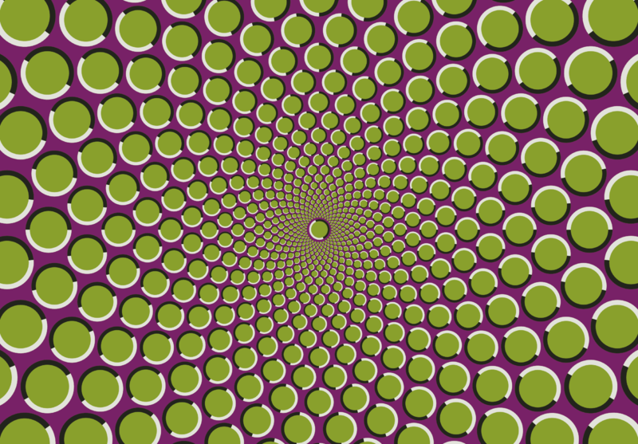
    <figcaption>Movement illusions</figcaption>
</figure>

V:

## Optical Illusions (others)

<figure>
    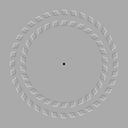
    <figcaption>Movement illusions</figcaption>
</figure>

V:

## Optical Illusions (others)

<figure>
    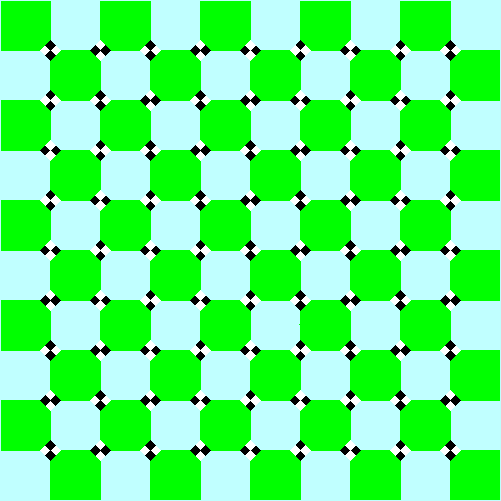
    <figcaption>Checker</figcaption>
</figure>

V:

## Optical Illusions (others)

<figure>
    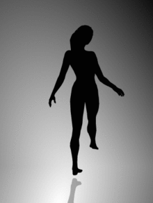
    <figcaption>Spinning dancer</figcaption>
</figure>

V:

## Optical Illusions (others)

<figure>
    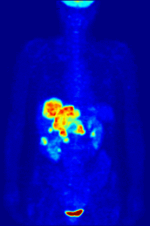
    <figcaption>Positron imagery</figcaption>
</figure>

H:

## References

* [Cueva de Altamira](http://es.wikipedia.org/wiki/Cueva_de_Altamira)
* [Chauvet Cave](http://en.wikipedia.org/wiki/Chauvet_Cave)
* <a href="http://en.wikipedia.org/wiki/Perspective_(graphical)">Perspective</a>
* [Linear Perspective](http://new.math.uiuc.edu/public403/perspective/alberti/alberti.html)
* [Albrecht Dürer](http://en.wikipedia.org/wiki/Albrecht_D%C3%BCrer)
* [The origins of perspective](https://www.dartmouth.edu/~matc/math5.geometry/unit11/unit11.html)
* [Depth perception](http://en.wikipedia.org/wiki/Depth_perception)
* [Optical Illusion](http://en.wikipedia.org/wiki/Optical_illusion)